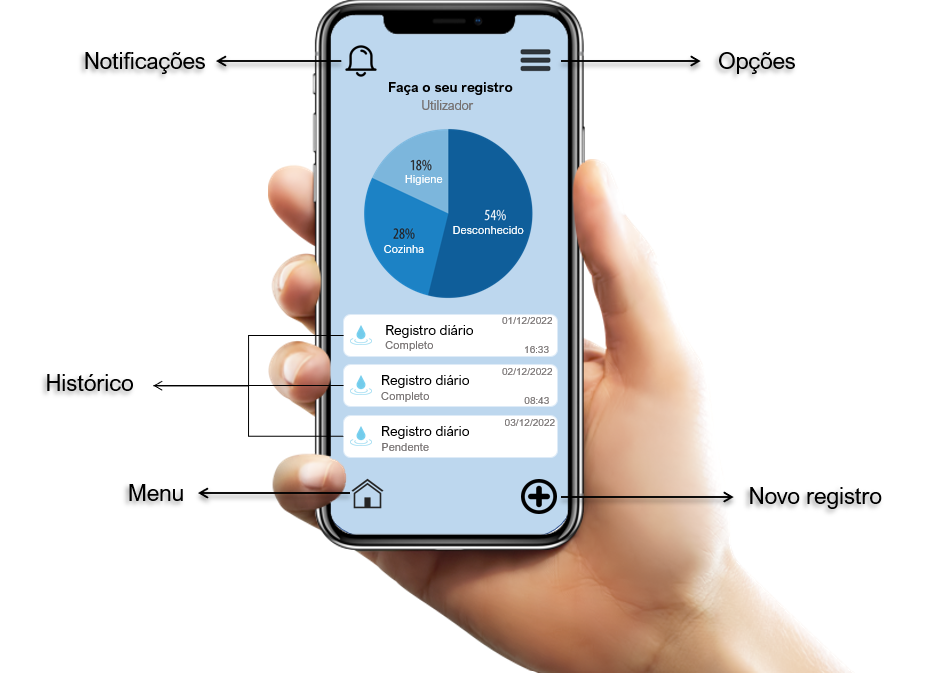
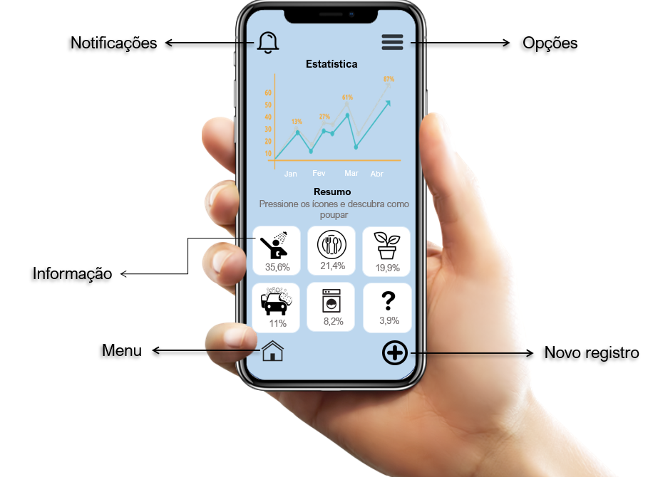
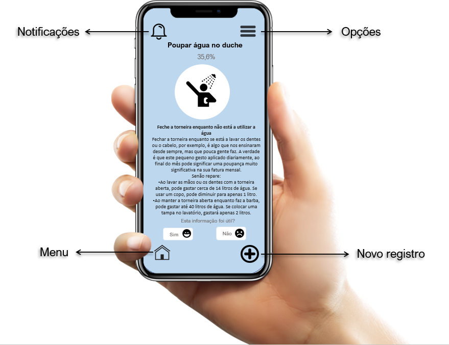

# EA

## Autores:

| Número     | Nome         |
|------------|--------------|
|  20190904  | Naiara Cunha |
|  20190952  | Karine Cardoso |

## Enquadramento
A escassez dos recursos hídricos é um problema que é discutido a anos, estimando-se que 97,5% da água existente no mundo é salgada e não é adequada ao consumo humano ou à irrigação de plantas. E dos 2,5% de água doce, a maior parte (69%) é de difícil acesso, pois está concentrada nos glaciares, 30% são águas subterrâneas (armazenadas em aquíferos) e 1% encontra-se nos rios [1].\
Uma das soluções para a resolução desta adversidade é lecionar os jovens desde cedo como racionalizar o consumo de água. No entanto, são poucos aqueles que põe em prática esses ensinamentos de tal modo que as diferenças registadas entre os países desenvolvidos e os em desenvolvimento evidenciarem que a crise mundial dos recursos hídricos está diretamente ligada às desigualdades sociais.\
Em regiões onde a situação de falta de água já atinge índices críticos de disponibilidade, como nos países do Continente Africano, onde a média de consumo de água por pessoa é de dez a quinze litros/pessoa. Já em Nova York, por exemplo, há um consumo exagerado de água doce tratada e potável, onde um cidadão chega a gastar dois mil litros/dia [1.1]. E segundo a Organização das Nações Unidas (ONU), mais de 2,7 bilhões de pessoas deverão sofrer com a falta de água em 2025 se o consumo do planeta não diminuir [1.2].\
De modo a reforçar o consumo de água através do ensino criaremos uma aplicação que registe o modo de consumo de água e como reduzir o mesmo, enviando notificações, caso o utilizador assim o permita, de modo a que as pessoas possam repensar as suas formas de uso de água, como por exemplo, fazendo a captação da água da chuva e o seu reaproveitamento, bem como a água que é utilizada para a lavagem das roupas, etc. Estas são algumas medidas que devem ser tomadas para que haja um consumo consciente e ecológico.\
Baseamos o nosso projeto em apps de rastreamento do consumo de água como Virtual Water, Water1der e Water Use Calculator[2].

### Tracking

**Descrição:**\
Nesta janela o utilizador poderá ver um resumo dos seus registros diários, semanais ou mensais; bem como aqueles incompletos ou por preencher.

**Pré-condições:**
- Ter uma ligação à rede WiFi ou dados móveis.
- Criar uma conta.

**Passo a passo:**
- Para uma primeira utilização a app fará algumas questões como o número de pessoas que residem no estabelecimento; a quantidade de água que foi consumida no mês anterior , algo que pode ser observado no contador de água ou na respetiva fatura; e como foi utilizada a água, por exemplo: regar, beber, limpar, etc. 
- 24 horas após cada registo a app questionará novamente como foi consumida a água naquele dia e quantia, caso o utilizador saiba.
- Ao fim de cada mês a aplicação será capaz de fazer uma avaliação e determinar se o consumo de água é ou não excessivo e como o pode diminuir.
- O utilizador terá a opção de receber lembretes para registar o modo de consumo diariamente, semanalmente, mensalmente, ou não as receber, de modo que seja preservada a sua privacidade.

**Pós-condições:**
- Guardar as informações inseridas. 

### Estatística

**Descrição:**\
Aqui será informado quanto o utilizador consumiu comparando aos dias anteriormente reportados e, se necessário, em que áreas deve diminuir esse consumo.

**Pré-condições:**
- O utilizador deve fazer pelo menos 7 registos do seu consumo ao fim de mês.

**Passo a passo:**
- O utilizador deverá selecionar o ícone de menu. 
- No menu deverá selecionar a opção "Estatística".
- Após um determinado número de registos, será apresentado um gráfico comparando o consumo de cada mês e por baixo será apresentada como foi feito o mesmo.

**Pós-condições:**\
NA. 

### Soluções

**Descrição:**\
Após o utilizador ter selecionado a área em que pretende diminuir o seu consumo, será apresentada um conjunto de soluções que mais se adequem ao seu gosto.

**Pré-condições:**
- Ter uma ligação à rede WiFi ou dados móveis.
- O utilizador deve selecionar um problema para obter as soluções.
- O utilizador deve fazer pelo menos 7 registos do seu consumo ao fim de mês. 

**Passo a passo:**
- Quando selecionado o problema serão expostas soluções.
- Uma vez lida a informação o utilizador deverá selecionar se a informação foi ou não útil, opções estas que aparecem no final de cada solução.
- Selecionada a opção as soluções adequar-se-ão cada vez mais ao dia-a-dia do utilizador.

**Pós-condições:**\
NA. 

## Referências:
Sites  
[1] ANA. Água no mundo. Acedido em: 31, 10, 2020, em: https://www.ana.gov.br/panorama-das-aguas/agua-no-mundo
\
[1.1] Águas Interiores. O problema da escassez de água no mundo. Acedido em: 31, 10, 2020, em: https://cetesb.sp.gov.br/aguas-interiores/informacoes-basicas/tpos-de-agua/o-problema-da-escasez-de-agua-no-mundo/
\
[1.2] Gyssele Mendes. 6 soluções de países diferentes contra a escassez de água. Acedido em: 31, 10, 2020, em: https://cebds.org/escassez-de-agua/#.X51c44j7Q2w 

Produtos similares\
[2] Seametrics. 10 Useful Water Conservation Apps. Acedido em: 31, 10, 2020, em: https://www.seametrics.com/blog/water-conservation-apps/
